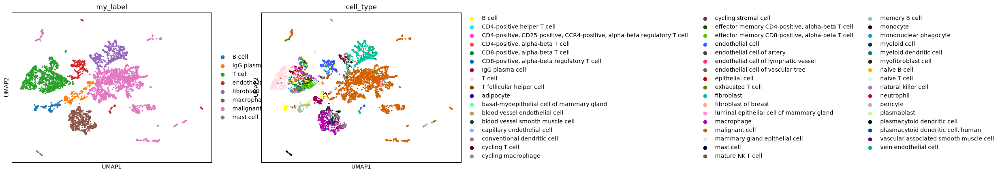

# Single-Cell RNA-seq of the Breast-Tumour Microenvironment

Unsupervised recovery of the cell types in a human breast tumour from single-cell transcriptomes, then
**validation against expert labels**. Real cells are fetched **live from the CELLxGENE Census API** (not
a packaged tutorial dataset), clustered and annotated from marker genes with **Scanpy**, and reproduced
on the identical cells in **R/Seurat**.



## Aim

What cell types make up a human breast tumour, and can they be recovered without supervision from
single-cell RNA-seq — with the resulting marker-based cell-type calls independently agreeing with expert
annotation, not just looking plausible?

## Objective

Fetch real human breast-tumour single-cell data live from a real public data corpus, run a complete
unsupervised scRNA-seq pipeline (QC, normalization, dimensionality reduction, clustering, marker-gene
identification, and biological annotation), and validate the resulting cell-type labels against
independent expert annotation shipped with the same dataset — cross-implemented in Python/Scanpy and
R/Seurat on the identical cells.

## Data fetch

Real human breast-tumour single cells fetched **live** from the **CELLxGENE Census** API (Chan Zuckerberg
Initiative's harmonised single-cell corpus, served as TileDB-SOMA over S3) via the `cellxgene-census`
Python client — not a packaged tutorial dataset. Query: `tissue_general == 'breast' and disease != 'normal'
and is_primary_data == True`. ~5,000 cells sampled, with the Census version pinned (`2025-11-08`) and
random seed fixed, so the exact cell set is reproducible.

## Data describe

Real UMI (unique molecular identifier) count data: a cell × gene matrix (~5,000 cells × ~30,000+ genes),
where each entry is the number of distinct mRNA molecules of that gene captured in that one cell — UMI
tagging before PCR means the count reflects real captured molecules, not PCR amplification bias. Most
entries are zero; some genuinely (the gene is off in that cell), many from real dropout (the gene is
expressed but wasn't captured, the defining technical nuisance of scRNA-seq that shapes every
downstream processing choice). The Census also ships expert `cell_type` labels for every cell — these are
deliberately ignored during this project's own clustering and used only afterward, to validate the
independently-derived annotation.

## Methods / Workflow — what we did

1. Fetch real cells from the Census API; run per-cell QC (genes detected, total UMI counts, %
   mitochondrial reads — loosened from typical PBMC thresholds to genes 200-6000 / mito < 15%, since
   dissociated tumour tissue is harsher on cells and malignant cells are often larger/more
   transcriptionally active than a strict standard cutoff assumes).
2. Library-size normalize (counts per 10k) and `log1p`-transform, so cells sequenced to different depths
   become comparable and expression's heavy tail is compressed.
3. Select the ~2,000 most highly variable genes — most genes are near-constant housekeeping noise that
   carries no cell-type information.
4. Scale (z-score) and run **PCA**, keeping ~40 principal components (denoising + compression: ~2,000
   genes down to ~40 numbers per cell capturing the main biological axes).
5. Build a kNN graph in PC space, embed it in 2D via **UMAP** for visualisation, and partition it into
   clusters via **Leiden** community detection.
6. Identify each cluster's marker genes via a **Wilcoxon rank-sum test** (which genes are significantly,
   substantially over-expressed in this cluster vs. all other cells).
7. Annotate each cluster's identity by matching its marker fingerprint against canonical breast
   tumour-microenvironment marker genes (e.g. EPCAM/keratins → epithelial/tumour; COL1A1 → fibroblasts;
   PECAM1/VWF → endothelial; CD3D/CD3E → T cells; MS4A1/CD79A → B/plasma cells; CD68/LYZ → macrophages;
   TPSAB1/CPA3 → mast cells).
8. **Validate**: cross-tabulate these independently-derived labels against the Census's own expert
   `cell_type` annotation — a strong diagonal means the marker-based calls agree with expert labels.
9. Reproduce the entire pipeline on the identical cells in R/Seurat, to cross-check the Python/Scanpy
   result with an independent toolchain.

## Results

The unsupervised pipeline recovers all expected tumour-microenvironment compartments: **malignant/
epithelial** (keratins, GATA3), **fibroblasts/CAFs** (collagens, ACTA2/TAGLN), **endothelial** (VWF/
PECAM1, lymphatic MMRN2), **T cells** (CD3D/CD3E), **B/plasma cells** (MS4A1/CD79A; IGKC/MZB1),
**macrophages** (CD68/LYZ), and **mast cells** (TPSAB1/CPA3). Cross-tabulating these labels against the
Census expert `cell_type` is near block-diagonal — the marker-based calls agree with independent
annotation.

**R/Seurat twin, on the identical cells**: malignant, endothelial, fibroblast, and macrophage labels each
strongly concentrate on their matching Census category (malignant: ~1,700/1,900 cells; endothelial: ~100%
across endothelial subtypes). Its "T cell" label is a broader lymphocyte super-cluster that also picks up
B/plasma cells, because the R pipeline used 10 PCs (`dims=1:10`, the standard Seurat tutorial default) vs.
Python's 40 — a real, explainable cross-tool parameter difference under-resolving lymphocyte subtypes,
documented rather than hidden.

## Biology interpretation of results

A solid tumour is not a homogeneous lump of malignant cells — it's a real biological ecosystem of
malignant epithelium embedded in stroma (fibroblasts, endothelium) with infiltrating immune cells (T
cells, B/plasma cells, macrophages, mast cells), and this analysis resolves exactly that structure
without ever being told the cell types in advance. Bulk RNA-seq of the same tumour would average all of
this into one blended expression profile, hiding the immune contexture that actually drives prognosis and
immunotherapy response — the entire value of single-cell resolution is recovering this mixture, not
compressing it away. The near-diagonal agreement between this project's own marker-based cell-type calls
and the Census's independently-generated expert labels is the real validation that the unsupervised
clustering + marker-annotation pipeline is correctly identifying real biological cell types, not
arbitrary statistical partitions of the data. The R/Seurat vs. Python/Scanpy T-cell/lymphocyte
resolution difference is itself informative: it demonstrates concretely that the number of principal
components retained is not a cosmetic parameter — it directly determines how finely related cell
subtypes (T cells vs. B/plasma cells, both lymphocytes) can be distinguished, and a tutorial-default
parameter choice that works for one dataset (PBMCs) can under-resolve a different, more heterogeneous
one (a solid tumour).

## Learning through project

Annotation is a supervised label placed on top of unsupervised structure — a cluster's identity is only
as good as the marker genes used to call it, and clusters that are actually doublets, cell states (e.g.
cycling cells), or technical artifacts rather than true cell types can still receive a plausible-looking
marker-based label if not checked against independent validation. Having the Census's own expert labels
available specifically to cross-validate (rather than to train against directly) is what makes this
project's cell-type calls trustworthy rather than merely plausible. UMAP geometry is for visual
inspection of local neighbourhood structure only — the distance between two "islands" or their relative
sizes carry no quantitative meaning, and treating them as if they did is a common, avoidable
misreading. Perhaps the most transferable lesson: a pipeline hyperparameter that looks like an
implementation detail (here, the number of PCs retained before clustering) can materially change which
real biological distinctions the analysis is even capable of making — demonstrated concretely by the
R/Python T-cell resolution difference, not asserted abstractly.

## Limitations

Results are parameter-dependent (QC thresholds, number of highly variable genes, number of PCs, Leiden
resolution — the R/Python PC-count difference above is a direct, observed example of this). UMAP geometry
is not quantitative. Annotation is marker-based, and a few clusters in each language lacked a clean
marker signature and were labelled via a ground-truth crosstab tiebreak rather than markers alone. The
Census pool spans multiple donors/datasets, so a rigorous study would batch-integrate (Harmony/scVI)
first. Proving an epithelial cluster is genuinely malignant (vs. normal epithelium) needs copy-number
inference (inferCNV/CopyKAT), which this project does not perform. NK cells fold into other clusters at
this resolution in both languages.

## Reproduce

**Python:** `pip install cellxgene-census scanpy leidenalg`, then run `single_cell_tme.ipynb` top to
bottom (needs internet for the Census fetch; first fetch takes a few minutes). **R:** run the notebook
first (it writes `data/tumor_10x/`), then `single_cell_tme.R` from the same folder
(`install.packages(c("Seurat","dplyr"))`).

## Tech

`Python` (Scanpy, leidenalg, cellxgene-census) · `R` (Seurat) · CELLxGENE Census API · PCA · UMAP ·
Leiden clustering · Wilcoxon marker-gene testing

## Files

```
single_cell_tme.ipynb    # Python / Scanpy pipeline (fetch → cluster → annotate → validate)
single_cell_tme.R        # R / Seurat twin (reads the same cells exported as 10x)
results_py/              # UMAPs, marker table, crosstab vs Census (Python)
results_R/                # UMAPs, marker table, crosstab vs Census (R)
data/tumor_10x/          # the fetched cells in 10x format (written by the notebook; feeds the R twin)
```

## License

All rights reserved — see `LICENSE`. This repository is public for portfolio/demonstration purposes
only; no permission is granted to copy, modify, or reuse any part of it.
